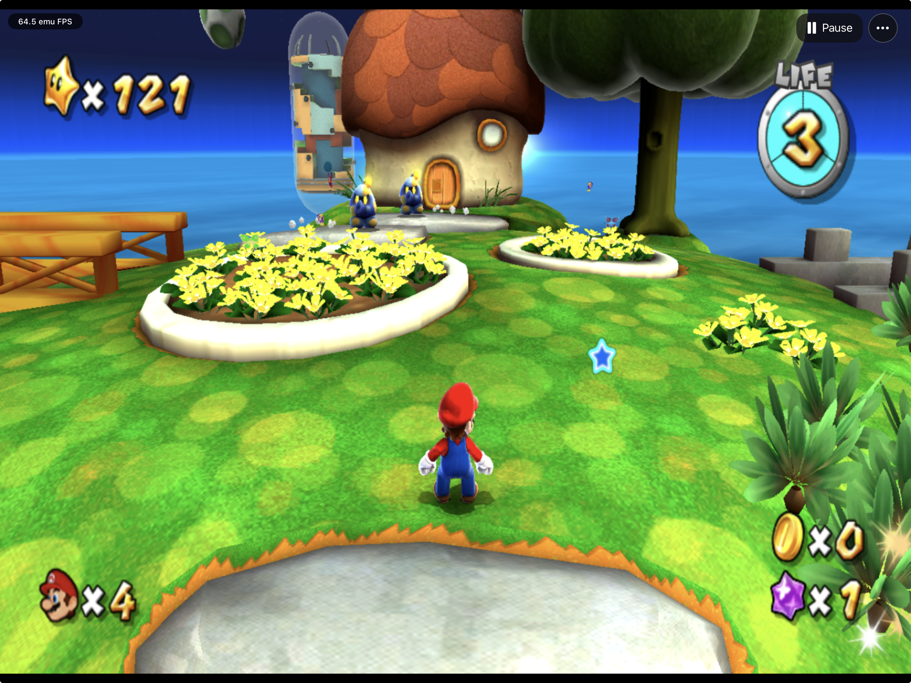
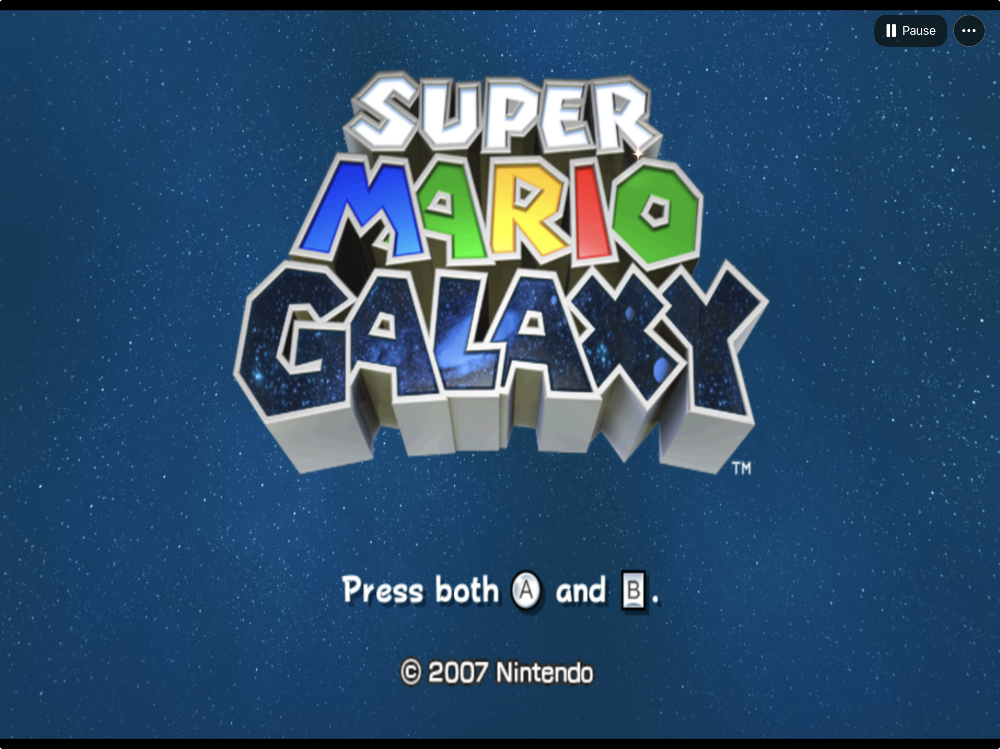
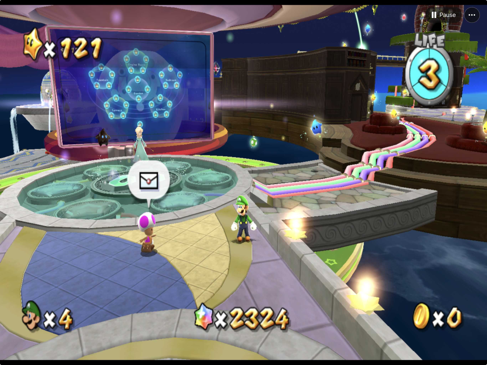

# GalaxyPad

<p align="center">
  
  
  
  
  
  
  <a href="https://discord.gg/xwHfUD2bxW"></a>
</p>

**Super Mario Galaxy on iPhone, iPad, and Apple silicon Mac through ahead-of-time recompilation.**
GalaxyPad is an experimental Apple app with Metal rendering, touch controls, and
controller support. It started as a personal experiment and has continued to grow.

The game's PowerPC code is recompiled ahead of time into native ARM64 code; the
Dolphin-derived runtime supplies graphics, audio, and other Wii hardware behavior.
You supply your own supported game image; GalaxyPad does not download or include it.

Built with [ModernGekko](https://github.com/ExpansionPak/ModernGekko), by Hyperway,
ExpansionPak and contributors, and [DolRecomp](https://github.com/ExpansionPak/DolRecomp),
on the [RecompCore](https://github.com/ExpansionPak/RecompCore) /
[Dolphin](https://github.com/dolphin-emu/dolphin) runtime. See [full credits](CREDITS.md),
including the SunPad Apple integration this project builds on.

**Maintained dependency forks:** [ModernGekko](https://github.com/chrissotraidis/ModernGekko),
[RecompCore](https://github.com/chrissotraidis/RecompCore), and
[DolRecomp](https://github.com/chrissotraidis/DolRecomp).
GalaxyPad is the Apple app repository; its runtime and compiler changes live in
these forks, selected through pinned submodules. See the
[source graph and upstream links](docs/DEPENDENCIES.md#maintained-source-graph).



## Experimental preview

[Download Preview 4 for iPhone and iPad](https://github.com/chrissotraidis/galaxypad/releases/tag/v0.1.0-preview.4)
(build 7168). The [macOS Preview 1](https://github.com/chrissotraidis/galaxypad/releases/tag/v0.1.0-preview.1)
remains available separately; it has not been rebuilt for this update.
The repository and preview downloads are public.

The IPA requires signing with your own Apple account before installation; it is
not a TestFlight or App Store build. The Mac app is ad-hoc signed and not notarized.
Both packages contain the AOT game-code module but no game image, extracted game
assets, or saves. Supply the supported image yourself. Read the
[preview notes](docs/PREVIEW-2026-09-19.md) for installation and known limitations.

## Current status

**Preview 4 (build 7168)** adds optional device/controller gyro cursor aiming and
manual **Ray Surfing / Star Ball** stick modes for iPhone and iPad. Open **Controls**
to select them; gyro defaults to Off. Return Stick Mode to **Normal** after a ride.
Sensitivity, vertical inversion and recenter controls are included.

This release keeps Preview 3's compatible WBFS importer, simplified Plus control,
Game Mode metadata and tested runtime/audio refinements. The native host is rebuilt
on current main. Automated input, sensor-adapter and menu checks pass; physical gyro
feel and completion of the affected ride levels still need player validation.
See the [release notes and validation limits](docs/PREVIEW-2026-09-19.md).

Demanding scenes can still slow down, especially on iPhone. This is a controls
update; no new FPS improvement or complete-game compatibility is claimed. The
public IPA is prepared for recipient signing, which requires preserving the
existing bundle/signing identity to update without losing app data.
The HUD counts frame events rather than guaranteeing displayed frames.

| Area | Current result |
| --- | --- |
| Game setup | Exact USA `RMGE01`, revision 0 input validation and local import |
| Rendering | Metal gameplay; corrected depth access restores tested Pull Star activation and level entry |
| Controls | Touch/controller input, optional gyro cursor, manual ride stick modes, and editable touch layouts |
| Platforms | iPhone/iPad app targets and Apple silicon Mac development package; configured minimums are not verified device compatibility |
| Release | Experimental public preview; iPhone performance and full-game acceptance remain open |

See [current status](docs/STATUS.md), [performance evidence](docs/PERFORMANCE-2026-09-12.md),
[release readiness](docs/RELEASE-READINESS.md), and the [development journal](docs/JOURNAL.md)
for exact tested builds and remaining issues. Simulator results do not establish
physical-device performance.

## Screenshots

<table>
  <tr>
    <td width="50%"></td>
    <td width="50%"></td>
  </tr>
  <tr>
    <td align="center"><strong>The original adventure</strong><br>Galaxy's title screen in the native Apple app.</td>
    <td align="center"><strong>Explore the Observatory</strong><br>Luigi at the galaxy map with 121 stars.</td>
  </tr>
</table>

Screenshots supplied by the project owner show development gameplay. They are
included unchanged; individual HUD readings are not sustained-performance claims.

## Frequently asked questions

<details>
<summary><strong>Is this native recompilation or emulation?</strong></summary>

Both techniques are involved. Super Mario Galaxy’s PowerPC game code is
recompiled ahead of time into ARM64 machine code that executes directly on
Apple silicon. The game still expects Wii hardware, so a Dolphin-derived runtime
provides the graphics, audio/DSP, memory, timing, and input behavior it needs,
using Metal for rendering. Interpreter fallbacks remain for code outside the
recompiled coverage; iOS uses no runtime PowerPC JIT.

The precise description is **ahead-of-time recompiled game code on a
Dolphin-derived compatibility runtime**. GalaxyPad is a game-specific Apple app,
not a general Wii loader or a from-scratch source port. Native ARM64 execution
removes runtime translation for the recompiled code; it does not remove the
cost of reproducing Wii hardware behavior.

</details>

<details>
<summary><strong>Is the game included, and which version do I need?</strong></summary>

No game image, extracted assets, or save is included. Supply your own legally
obtained supported USA `RMGE01`, revision 0 image. The exact identity is pinned in
[disc identity](config/galaxypad-disc.json); other revisions and regions are not
automatically compatible. See the import instructions below.

</details>

<details>
<summary><strong>Can I install it now?</strong></summary>

[Preview 2](https://github.com/chrissotraidis/galaxypad/releases/tag/v0.1.0-preview.2)
provides the latest iPhone/iPad IPA; the separate Apple silicon Mac app remains in
[Preview 1](https://github.com/chrissotraidis/galaxypad/releases/tag/v0.1.0-preview.1). The IPA needs
your own Apple signing. Configured targets are iOS/iPadOS 16 and macOS 14; these
are not verified minimum-device recommendations.

</details>

<details>
<summary><strong>Does it run at 60 FPS?</strong></summary>

Lighter scenes reach 60 FPS. Heavy scenes still slow down, and users still report
audio underruns. The current depth-enabled heavy-scene Simulator result is about
45–49 frame events/s. See [performance evidence](docs/PERFORMANCE-2026-09-12.md)
for the measurement limits and the [current refinement pass](docs/REFINEMENT-2026-09-15.md)
for device findings and the next experiments. A screenshot at 60 does not establish
a consistent 60 FPS experience.

</details>

<details>
<summary><strong>How do controls and Pull Stars work?</strong></summary>

Movement and pointer aim are separate. Aim at a Pull Star until the hand cursor
appears, then press and hold A. On the default controller mapping, right shoulder
also provides A so your thumb can stay on the aiming stick; right trigger provides
B. Touch controls can be moved and resized.

Pause, touch Start +, and Xbox Menu open Galaxy's original pause menu. Its options
depend on the scene; supported levels offer a return to the Observatory. Xbox
View/Select separately freezes and resumes the app. See
[Input and pointer](docs/INPUT-AND-POINTER.md) for mappings and tested behavior.

</details>

<details>
<summary><strong>Will updates preserve my save?</strong></summary>

In-place installation is the development update path. Uninstalling the app can
remove its local data. Back up saves before changing installation or signing
boundaries; see [save and NAND handling](docs/SAVE-AND-NAND.md).

</details>

<details>
<summary><strong>How can I report a problem?</strong></summary>

Open the three-dot menu → **Report a Problem**, describe the issue, and review
the GitHub draft with its device/build and runtime context. **Open GitHub Draft**
opens GalaxyPad's issue form for you to review and submit.

Diagnostic logs are optional and off by default. Enable them in the preview,
review the sanitized report, and use **Share Log** to save a copy for manual
attachment to the issue. Nothing is uploaded or submitted automatically. Never
attach game images, extracted data, saves, or signing material. The tracker is
public; a GitHub account is required to submit an issue.
You can also join the [GalaxyPad Discord](https://discord.gg/xwHfUD2bxW) for
community discussion.

</details>

## Supported game data

The supported game remains **USA RMGE01, revision 0**. Preview 3 validates supported executable content in bounded single-disc
WBFS containers, allowing compatible differences in container layout. The canonical
development image remains pinned in [disc identity](config/galaxypad-disc.json). Other
regions/revisions, ISO and split/multidisc WBFS remain unsupported. See the
[validation policy](docs/DISC-IDENTITY.md); a different hash alone proves neither
compatibility nor incompatibility in the newer importer.

Supply your own authorized local image. GalaxyPad does not download games.
Keep images in ignored `ref/` and extractions, generated modules, saves and runtime
evidence in ignored local storage. Never commit those files.

## Build from source

<details>
<summary><strong>Developer prerequisites and build commands</strong></summary>

Development currently targets Apple silicon with full Xcode and its iOS SDKs,
CMake, Ninja, and the pinned dependencies listed in
[DEPENDENCIES](docs/DEPENDENCIES.md) and the [dependency lock](config/dependencies.lock.json).
GalaxyPad keeps its runtime and compiler changes in maintained forks—copies of
the upstream projects with the Apple changes recorded as commits. The app selects
exact versions through submodules; it does not rename those tools or claim their
original work. See [the dependency guide](docs/DEPENDENCIES.md) for the source graph.
Configured minimums are macOS 14 and iOS/iPadOS 16; these are not tested-device
compatibility promises. The pinned Intel WIT tool also requires Rosetta.

**The mobile build is currently tied to accepted local module and PGO artifacts.**
It is not yet a one-command clean-clone build. Scripts reject mismatched inputs;
do not bypass their identity checks to make a build succeed.

Run commands from the repository root. Source setup and exact-image verification:

```sh
bash scripts/bootstrap-dependencies.sh
bash scripts/verify-disc.sh ref/supermariogalaxy.wbfs
```

For source checks alone, `bash scripts/bootstrap-dependencies.sh --sources-only`
prepares ModernGekko, RecompCore and DolRecomp without their third-party build
dependencies. The default command above also initializes the required Apple build
dependencies. Add `--references` when you need the optional pinned SunPad, Petari
and template research references.

With the verified extraction already prepared at `generated/extracted/run1`,
the desktop stages are:

```sh
bash scripts/build-desktop-tools.sh
bash scripts/generate-aot.sh
bash scripts/build-module.sh
bash scripts/build-macos-app.sh
```

The default desktop package is `generated/macos/GalaxyPad.app`. Read
[executable coverage](docs/EXECUTABLE-COVERAGE.md) and the build scripts before
replacing an accepted module with a newly generated one.

For a prepared, identity-matched mobile workspace, the Simulator stages are:

```sh
bash scripts/build-ios-simulator-core.sh
bash scripts/provision-ios-simulator-core.sh
bash scripts/build-ios-simulator-module.sh
bash scripts/build-ios-simulator-app.sh
```

The app is produced under `generated/build/ios-simulator-app/`. A Simulator app is
not a device app. The scripts select a separate device lane with
`GALAXYPAD_IOS_SDK=iphoneos`; signing and private staging are separate steps in
`scripts/stage-private-ios-device.sh`. See [mobile implementation](docs/MOBILE-IMPLEMENTATION.md), the
[original PRD](docs/GALAXYPAD-PRD.md), and [active goal loop](docs/GALAXYPAD-GOAL-LOOP.md).

</details>

## Install on your physical iPad

Double-click **Install on iPad.command** for native Mac setup dialogs:

- Export the current private unsigned IPA and reveal it in Finder.
- Install a signed GalaxyPad app onto your connected iPad.
- Open signing and first-launch instructions.

Follow [Install on iPad](docs/INSTALL_IPAD.md). An Apple signing identity and
matching provisioning profile are still required; the assistant does not create
them or ask for your Apple password. The candidate is experimental; installation and early iPad gameplay do not
establish release readiness. No game image or save is included or uploaded.

## First launch and game data

Use the mobile three-dot menu's game-data import actions for the supported input.
The host validates identity rather than accepting arbitrary games. Import requires
at least 9 GiB available for the private image copy, extraction and headroom;
existing data and saves are not counted as reclaimable space.

For a private self-contained Simulator bundle, stage the built host and module
with `GALAXYPAD_IOS_SDK=iphonesimulator bash scripts/stage-private-ios-device.sh APP_PATH`.
Despite its historical name, this script validates either SDK explicitly; its
default remains device staging. Sign the copied Simulator module and then the
copied app ad hoc before installation. Staging alone does not sign or install.
Import, data
removal, and saves are separate responsibilities—read
[save and NAND handling](docs/SAVE-AND-NAND.md) before changing local data.
The desktop development package uses its prepared local module/data workflow;
it does not imply mobile import or packaging acceptance.

Avoid concurrent game or Simulator workloads during performance measurements. Do not erase a
Simulator or replace a save merely to resolve a launch problem.

## Controls and the three-dot menu

The active mobile overlay adapts SunPad's actual controls/editor and native
`UIMenu`, with Galaxy-specific Wii Remote + Nunchuk actions. It is not a claim
that Galaxy originally supports a GameCube controller.

- Movement, pointer aim, A/B actions and Spin have distinct input paths.
- Controls includes a Touch Control Guide, touch visibility, layout settings, controller mapping, and
  optional tilt and extra Wii buttons. Rarely used buttons need not stay visible.
- **Controls → Stick Mode (Touch / Controller)** selects **Normal**, **Ray Surfing**,
  or **Star Ball** for this app session. Ride modes route the controller left stick
  and touch movement stick to Wii tilt and hide pointer aim. Select the mode when
  boarding; return to Normal for walking and pointer menus. There is no automatic
  stage detection. Ray uses A to accelerate and Spin to jump; Star Ball uses A to
  jump and an upright remote pose. Releasing the stick returns to the resting tilt;
  it does not override the game's momentum or braking physics.
- Touch Tilt Stick offers 0.5× / 1× / 1.5× sensitivity, vertical inversion and
  recenter. These affect only touch tilt, not movement or controller input;
  the optional tilt stick also uses the selected ride pose. The new ride modes
  still require physical gameplay validation; gyro ride tilt is not implemented.
  See [ride-control investigation](docs/RIDE-CONTROLS.md).
- **Controls → Gyro Cursor → This Device / Controller** enables gyro aiming for
  the Star Pointer. Off is the default. This Device uses the iPhone/iPad's motion
  sensors; Controller uses the active controller's motion profile when supported.
  Sensitivity (0.5× / 1× / 1.5×), vertical inversion and Recenter are in the same
  menu. Clicking the right stick also recenters. The right stick adjusts gyro aim;
  a held touch takes priority, and gyro resumes from that touch position on release.
  Gyro aiming suspends during ride modes, native menus, pause and backgrounding.
  Sensor gaps freeze angular movement while preserving stick adjustment. Missing
  motion support leaves touch/stick controls available and shows a status message.
  These paths have synthetic Simulator coverage; physical sensor feel, drift and
  retail pointer interactions still need validation. See [gyro details](docs/GYRO-CURSOR.md).
- Display contains rendering options; unsupported aspect-ratio choices are
  currently disabled. Higher rendering resolution is not a CPU slowdown fix.
- Audio contains main-volume presets and mute, preserving the chosen level when
  unmuted. Packaged Simulator menu/stop/relaunch retention is checked; audible
  output validation and separate Wii Remote speaker volume are still pending.
- Game-data actions, diagnostic sharing, About and confirmed Stop are available
  through the native menu, subject to host support.
- After stopping, gameplay controls disappear and **Restart Game** starts a new
  runtime without closing the app. One packaged iPhone Simulator stop/restart
  cycle is verified; broader lifecycle and physical-device coverage remain open.
- Game Data & Save Status shows the supported revision and expected DOL hash,
  plus imported-image/save-file presence. It does not revalidate data or inspect
  completed stars; a detected file is not proof of a healthy save.

Exact mappings, pointer limitations and tested interactions live in
[Input and pointer](docs/INPUT-AND-POINTER.md). The desktop diagnostic defaults
are WASD movement, mouse pointer, J=A, K=B, U=C, I=Z, L=Spin and Return=Plus.
These are not a final editable desktop-control specification.

Touch layout, simultaneous input, menu dismissal/input clearing, and small-screen
usability still require acceptance. Do not infer physical multitouch usability
from a scripted Simulator test.

To adjust controls, open **Controls → Touch Control Settings → Move controls**.
Select a control to change its size, then choose **Done**. **Reset This Device
Layout** restores positions and sizes for that device, preserving opacity and
controller-visibility preferences. Custom positions survive default-layout
updates. Known phone issues include overlap with Back and some story text. The
default phone pause position now clears the observed confirmation and plaza views;
its gameplay pause behavior still needs a conclusive input check.
These are open layout defects, not a finished touch experience.

## Diagnostics and troubleshooting

Use **Share Diagnostic Log** in the three-dot menu. Review the exported contents
before sharing; keep game data, saves, private paths and captured game media out
of public reports. Include the app/module identity, device or Simulator model,
scene, steps to reproduce, and whether audio slows with the picture.

**Slow gameplay or cutscenes:** this is an open project defect, not something we
assume is your machine. Compare the same scene and separate CPU time, presentation,
audio and host pressure. Experimental native movie decoding is off by default
and is not a general gameplay fix. See [performance notes](docs/PERF.md).

**Input appears frozen:** confirm the game has focus, the menu/editor is closed,
and controls are enabled. Diagnostic desktop profiles can disable background
input. Do not repeatedly send inputs without checking the visible game state.

**Build rejects a hash:** check the exact pinned input and artifact provenance;
do not disable the guard or substitute a different revision.

**Storage pressure:** `generated/` contains large local build and evidence files.
Inventory exact paths first; preserve active packages, source images and saves.
No blanket cleanup command is recommended.

## Validation

`bash scripts/check-repository.sh` runs repository checks. UIKit checks are
separate: `bash tests/run-mobile-ui.sh BOOTED_SIMULATOR_UUID` requires exactly one
already-booted Simulator and installs an isolated test app. Passing these checks
does not prove game completion, smooth presentation, audio, or device readiness.

## Project map

| Path | Purpose |
| --- | --- |
| `apple/ios/` | Native mobile host, Metal view, active `GalaxyPadGameOverlay.mm` and menu adapters |
| `apple/shared/` | Input, settings, diagnostics and shared integration |
| `config/` | Exact disc identity and pinned dependencies |
| `patches/` | Explicitly opt-in experiments; normal dependency changes live in forks |
| `scripts/`, `tests/` | Build, audit and regression tools |
| `docs/` | PRD, goal loop, evidence and handoffs |
| `ref/ModernGekko/` | Pinned runtime fork, with nested RecompCore and DolRecomp dependencies |
| Other `ref/` paths, `generated/` | Local references/data and build/runtime artifacts |

## Credits, legal and contributing

GalaxyPad builds on SunPad, ModernGekko, RecompCore/Dolphin, DolRecomp and WIT;
Petari is a source reference. Exact upstream URLs and revisions are recorded in
the [dependency lock](config/dependencies.lock.json). Preserve upstream notices
and license obligations when adapting code. Nintendo's game and trademarks belong
to their respective owners; this project is not affiliated with Nintendo.

Follow [CONTRIBUTING](CONTRIBUTING.md) and the repository's [agent instructions](AGENTS.md).
Changes should be small and explainable, with regressions for behavioral fixes and
the full source suite passing. Record visible results and known failures, not just
counters or successful builds. Runtime/compiler changes belong in the maintained
forks; new releases require recorded build inputs and artifact identities.
Do not include retail content, generated game code, modules, or saves.
Only submit screenshots you are authorized to share. This README is not a distribution license; consult
[RIGHTS-STATUS](docs/RIGHTS-STATUS.md) before any publication.
